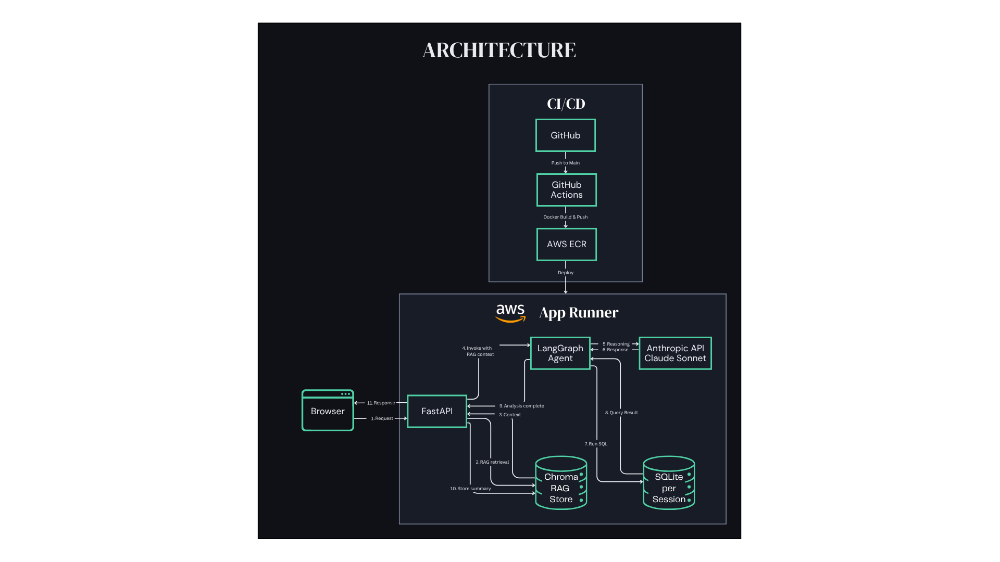
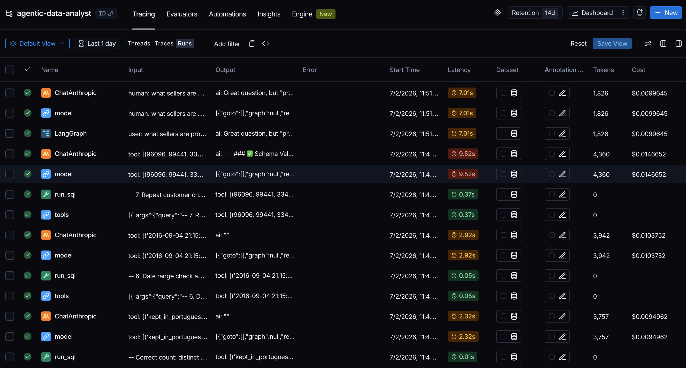

# Agentic Data Analysis Assistant

A natural language interface for data analysis. Upload one or more CSVs, ask questions in plain English, and receive answers backed by actual data — including exploration, querying, transformation, and business recommendations.

Built as a production-grade agentic application using LangChain, FastAPI, and the Claude API, deployed on AWS with Docker and GitHub Actions CI/CD.

---

## Demo

https://github.com/user-attachments/assets/7eb5faed-68f5-4a9b-ac05-7cf7c1aae539

---

## Architecture



*Simplified — actual flow includes conditional branches and conversational loops.*

**Key principle:** The LLM never touches raw data. It sees schema and column samples only. Computation runs on the actual data outside the model and results are passed back for interpretation.

---

## Input Types

The agent accepts four types of input to build context for analysis:

| Input | Format | Processing | Destination |
|---|---|---|---|
| Dataset files | CSV | pandas → SQLite | Queryable database |
| Documentation / data card | URL or plain text | Embedded as text | Chroma (RAG) |
| Data dictionary | CSV (column name → description mapping) | Embedded as text | Chroma (RAG) |
| Schema diagrams | Image (PNG, JPG) | Claude vision → text description | Chroma (RAG) |

All non-CSV context ends up in Chroma regardless of input format. Schema images go through a preprocessing step — Claude vision extracts a text description, which is then embedded and stored alongside the other documentation.

**Out of scope / future development:** Formal ERD files (Lucidchart, dbdiagram.io exports). Schema images via Claude vision cover this use case sufficiently for the current scope.

---

## Design Decisions

**Context files are not stored permanently.**
Data cards, data dictionaries, and schema images are sent to Claude during the setup phase to build understanding — but they are not embedded and stored in the RAG vector store directly. Instead, Claude's resulting understanding of the dataset (schema summary, confirmed key relationships, clarified handling rules) is what gets stored. This keeps Chroma lean and focused on actionable knowledge rather than raw input material. The original context files remain in the context/ folder and can be re-used if the setup phase is re-run.

**TODO:** The setup conversation is currently stored verbatim. A better approach would be to pass the raw conversation through a summarisation prompt before storing — stripping out clarifying questions, misunderstandings, and filler, keeping only the confirmed decisions and schema understanding. This is a recognised pattern called memory consolidation (LangChain implements a similar pattern called ConversationSummaryMemory. Apply the same summarisation approach to analytical chat exchanges in Phase 1.

**Two-tier memory architecture — RAG for cross-analysis context, full history for within-analysis refinement.**
The analytical phase is structured as two nested loops:

- **Outer loop** — asks the user for a new business or analytical question. Each iteration represents one complete analysis. Once the user is satisfied with the answer, the conversation is summarised and stored in the RAG vector store, and the outer loop asks for the next question.
- **Inner loop** — refines the answer within a single analytical question. If the user is not satisfied with the agent's response, they can provide follow-up feedback and the agent iterates until the answer meets the user's needs.

Each loop uses a different memory strategy:

- **Outer loop (cross-analysis): When the user asks a new business question, relevant context from past analyses is retrieved via RAG (similarity search against the vector store) and injected into the system prompt. This is token-efficient and scales well — only relevant past work is retrieved, not the full history.
- **Inner loop (within-analysis):** When the user refines or follows up on the current analysis, the full conversation history of the current business question is passed to the LangChain agent on every invocation, until the question has been answered to the user's satisfaction. This makes sense because all previous turns within the current analysis are relevant to the refinement.

This distinction means cross-analysis memory is handled by RAG, while within-analysis memory is handled by full context passing.

**Prompt caching for schema context.**
The schema context (confirmed setup conversation) is included in every analytical system prompt and is identical across all requests. Anthropic's prompt caching feature is used to cache this content server-side — cached tokens are excluded from the API rate limit entirely and cost significantly less per token. This is critical for avoiding rate limit errors on the 30K TPM starter tier, and remains a cost optimisation at higher tiers. The `cache_control: ephemeral` flag is added to the schema context content block in every analytical API call. Cache window is 5 minutes — requests within the same window use the cached version at zero rate limit cost.

**Automatic retry on rate limit errors.**
All Claude API calls (agent invocations and direct messages.create calls) are wrapped in a retry helper that catches 429 rate limit errors and automatically retries up to 3 times with a 62-second wait between attempts. The user sees a slower response but no error or crashed request.

**Schema context injected directly for SQL generation, not retrieved via RAG.**
Claude understands SQL natively — no examples or teaching needed. What it does need is accurate, complete schema information (table names, column names, types, relationships) to write correct SQL for the specific dataset. Rather than relying on Chroma similarity search to retrieve the right schema chunks — which risks missing a table or column — the full confirmed schema is injected directly into every analytical prompt. This is a small fixed token cost but guarantees Claude always has complete information. RAG is used for richer contextual knowledge (data card, handling rules, past analyses); schema is always injected in full.

**Session-based file storage.**
In the API version, all user data is stored per session under `sessions/{session_id}/` — including uploaded CSVs (`data/`), context files (`context/`), the SQLite database, the setup conversation JSON, and the Chroma vector store. The root-level `data/` and `context/` folders exist only for local development when running `main.py` directly (CLI mode). They are not used by the API or frontend.

**CSV loading via pandas → SQLite.**
CSVs are loaded via pandas `read_csv()` for type inference and data quality handling, then written to a file-based SQLite database via `df.to_sql()`. SQLite was chosen over DuckDB for full compatibility with LangGraph's SQL tooling — DuckDB's SQLAlchemy dialect has known compatibility issues with LangChain's database connectors. SQLite is fully supported and sufficient for this project's scale.

pandas is used for the profiling step (shape, dtypes, NaN rates, unique counts) during setup, reading each CSV before it is loaded into SQLite.

**Scale note:** pandas loads data into memory — this works well for typical analytical datasets but will hit limits on very large files (multi-GB range). In a production environment with datasets of that size, a server-based database would be more appropriate.

**Serverless hosting via AWS App Runner.**
The app is hosted on AWS App Runner, which scales to zero when idle. This means there is no compute cost between sessions, making it suitable for portfolio use on the free tier. The tradeoff is a cold start delay of a few seconds on the first request after a period of inactivity — acceptable for this use case.

**Automated kill switch for cost protection.**
An AWS Budget threshold triggers an SNS topic, which invokes a Lambda function that pauses the App Runner service. This acts as a hard spending cap — if costs spike due to unexpected traffic or abuse, the service is automatically stopped rather than allowing unbounded charges to accumulate.

---

## Tech Stack

| Component | Tool | Reason |
|---|---|---|
| Frontend | HTML/JS | Clean chat UI, no framework overhead |
| Backend | FastAPI | Industry standard for ML API serving |
| Agent framework | LangGraph | Modern LangChain agent runtime — recommended approach as of LangChain v1.0 (October 2025); replaces legacy `create_sql_agent` and `AgentExecutor` |
| LLM | Claude API | Best available; swappable via config |
| Data layer | SQLite | File-based, no server, full LangGraph compatibility |
| Tracing | LangSmith | Traces the LangGraph analysis phase only — the setup/schema phase uses the raw Anthropic SDK directly and is not visible to LangSmith |
| Memory | Chroma | Conversational memory via RAG |
| Containerisation | Docker | Single container — FastAPI serves the frontend as static files |
| Cloud | AWS (ECR + App Runner) | ECR for images, App Runner for serverless container hosting |
| CI/CD | GitHub Actions | Auto-deploy on push to main |

---

## Observability

Every analysis run is traced via LangSmith. The trace below shows the agent generating a SQL query, executing it via the `run_sql` tool, and returning the result — all results are backed by actual query execution against the uploaded dataset.



---

## Running Locally

```bash
# Clone the repo
git clone https://github.com/Wilsbert12/agentic-data-analyst.git
cd agentic-data-analyst

# Create and activate virtual environment (Python 3.11)
python3.11 -m venv venv
source venv/bin/activate

# Install dependencies
pip install -r requirements.txt

# Add your API key
cp .env.example .env
# Edit .env and add your ANTHROPIC_API_KEY

# Start the server
uvicorn api:app --reload

# Open http://localhost:8000 in your browser
```

---

## API Key

This project requires an Anthropic API key. You can obtain one at [console.anthropic.com](https://console.anthropic.com).

Your API key is passed to the backend for the duration of your session and written to a temporary session file on the server for session persistence. It is not logged, not stored in any database, and is not accessible to other users. The session file is ephemeral — it is lost when the server restarts. Do not use a key with high spending limits.

---

## Known Limitations

**Session lifecycle — no persistence across browser refreshes.**
Sessions survive server restarts — session state is written to `sessions/{session_id}/session.json` and restored from disk on cache miss. However, each browser tab generates a new session ID on load, so refreshing the page starts a fresh session. Users would need to re-upload their data and re-run the setup phase after a refresh. Solving this properly requires a login system that maps users to persistent session IDs.

**No user accounts or session resume.**
Each browser session gets a unique session ID. There is no login system, so a user cannot resume a previous session after closing the browser. All session data is tied to the current browser tab.

**Disk space accumulates.**
Each session creates a folder under `sessions/{session_id}/` containing CSVs, a SQLite database, a Chroma vector store, and a JSON file. These are not automatically cleaned up. The "Clear Memory" button in the frontend deletes the current session folder. For the hosted AWS version, a server-side cleanup job (e.g. delete sessions older than 24 hours) would be needed in production.

**No result export.**
Analysis results are displayed in the chat interface only. There is no way to export results as PDF, CSV, or any other format. Planned as a future feature.

**Local vs hosted:**
The same codebase runs both locally (clone the repo, run `uvicorn api:app --reload`) and on AWS. The only difference is configuration. Locally, the API key can be set in `.env` for development. In the hosted version, users bring their own API key via the frontend. The "Clear Memory" button handles cleanup in both cases.

---

## V2 — Planned

- **Ollama integration** — swap Claude for a locally running open-source model via `.env` config flag, demonstrating LLM provider flexibility without code changes. Known limitation: Claude vision is used in V1 to preprocess schema images into text for Chroma. In Ollama mode this is no longer possible without the Anthropic API. Two options under consideration: (1) drop image input in Ollama mode and document it as a limitation, or (2) integrate a separate open-source vision model alongside Ollama for the preprocessing step. To be decided.
- **Kaggle API integration** — pull datasets directly by providing a Kaggle dataset URL, without manual downloading. The Kaggle API returns dataset files and metadata (description, column info, tags). Open question: whether schema diagram images uploaded as part of a dataset (e.g. the Olist ERD) are included in the API download — if yes, all three input types (CSVs, data card, schema image) could be automated. To be verified.
- **Multi-session persistence** — conversation history maintained across sessions, not just within a single session.

---

## Project Status

**Phase 1 — MVP locally ✓**
- [x] CSV loading via pandas → SQLite
- [x] Dataset profiling (shape, dtypes, NaN rates, unique value counts) — used internally as context for Claude during setup, not a user-facing output. Expanding to user-facing visualisations (distributions, histograms) is deferred — most users will be working with Kaggle datasets where this information is already available in the data card.
- [x] Schema confirmation loop — Claude reviews schema, sample rows, and profiling stats, asks clarifying questions, and outputs [SCHEMA CONFIRMED] when the dataset is fully understood
- [x] Store confirmed schema understanding in Chroma and as a JSON file in sessions/ — the JSON is the primary source for schema injection into every analytical prompt (see Design Decisions). the same content is also stored in the RAG vector store for future retrieval of past analyses.
- [x] NL → SQL → answer core loop (LangGraph SQL agent)
- [x] Memory consolidation — after each completed analysis, a clean summary is generated and stored in the RAG vector store. Only saved when the user confirms the answer is correct (YES in the confirmation loop). Misunderstandings, corrections, and dead ends are excluded from the summary via the summarisation prompt.
- [x] Simple HTML/JS frontend + FastAPI backend — MVP complete
- [x] Error handling — structured JSON errors, frontend toasts, automatic 429 retry with prompt caching

**Phase 2 — AWS deployment + CI/CD**
- [x] UI/UX update — nav bar, about section, screenshots
  - [x] Demo recording (replace static screenshots)
- [x] Dockerfile + ECR + App Runner
- [x] GitHub Actions CI/CD pipeline — auto-deploy on push to main (app files only)
- [x] AWS deployment + billing alarms and budget limits — email alert + automated kill switch (SNS → Lambda → App Runner pause) on budget threshold
- [x] Architecture diagram — embedded in README and website

**Phase 3 — Feature development**
- [ ] Kaggle API integration — pull datasets directly by URL
- [x] LangSmith tracing
- [ ] Session persistence (SQLite → RDS Postgres)
- [ ] User authentication
- [ ] Ollama integration — swap Claude for a local open-source model via config

**Phase 4 — Stretch**
- [ ] NL → pandas transformation layer
- [ ] Demo GIF
- [ ] Migrate from App Runner to ECS Express Mode — App Runner is no longer accepting new customers (April 2026); AWS recommends ECS Express Mode as the replacement. Existing App Runner deployments continue to work and receive security patches, but no new features will be added.