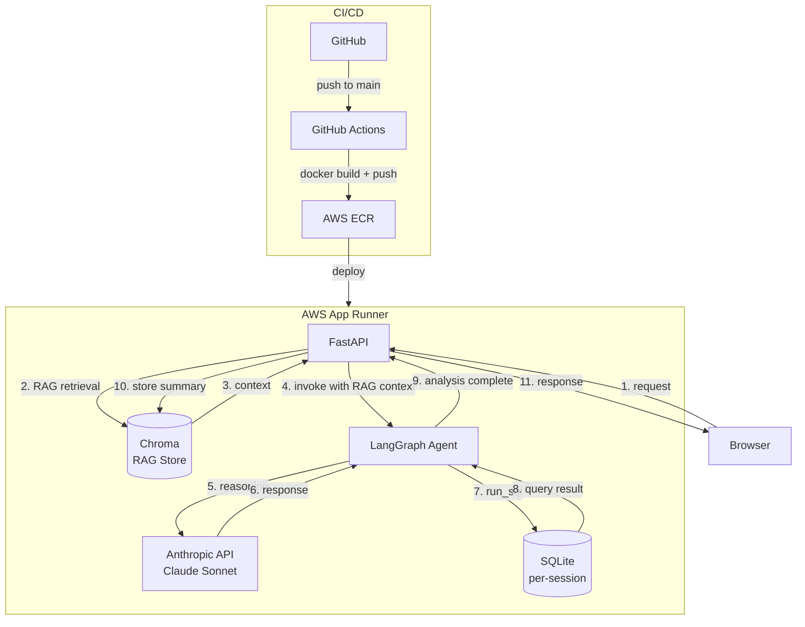

# Architecture

```mermaid
flowchart TD
    subgraph CICD[CI/CD]
        GH[GitHub] -->|push to main| GA[GitHub Actions]
        GA -->|docker build + push| ECR[AWS ECR]
    end
    ECR -->|deploy| AR

    Browser -->|1. request| FA
    FA -->|11. response| Browser

    subgraph AR[AWS App Runner]
        FA[FastAPI]
        FA -->|2. RAG retrieval| CH[(Chroma\nRAG Store)]
        CH -->|3. context| FA
        FA -->|4. invoke with RAG context| AG[LangGraph Agent]
        AG -->|5. reasoning| CL[Anthropic API\nClaude Sonnet]
        CL -->|6. response| AG
        AG -->|7. run_sql| DB[(SQLite\nper-session)]
        DB -->|8. query result| AG
        AG -->|9. analysis complete| FA
        FA -->|10. store summary| CH
    end
```
